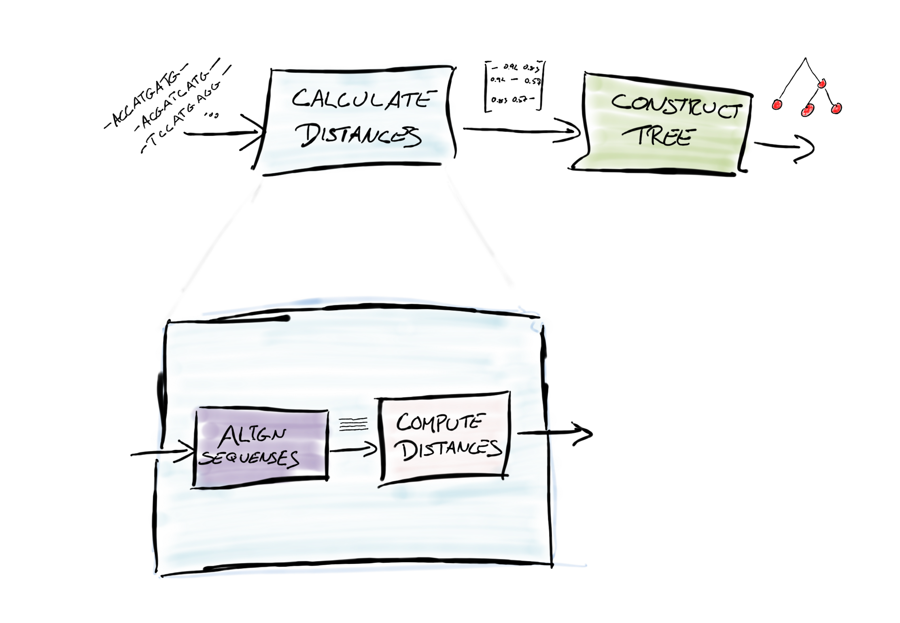

# Week 1: Introduction to computational thinking

## Objectives

* **To understand how we go from problem domains to models, specify problems and goals, derive algorithmic solutions, and finally implement our solutions.**
* **To get familiarity with programming in the Python programming language and using Jupyter notebooks.**

## Reading material

The textbook *Introduction to Computation and Programming Using Python* by John V. Guttag we will henceforth refer to as JVG.

For this week, please read chapters 1 and 2, and sections 3.1-3.2 and 3.4.

## Lecture notes

### What is computational thinking?

The focus of this class is to learn how to *formalise objectives* we are interested in, for whatever reason, in such a way that we can specify *mathematically and objectively* what solutions to our objectives are. Once we have such objective goals---so we know exactly what solutions will look like---we can derive ways of achieving such solutions as a *series of computations:* recipes that, if followed mindlessly step by step, will provide a solution.

There might be many such recipes for solutions, but we can compare them based on their (theoretical) *efficiency*---some recipes intrinsically reach a solution faster than others. When thinking about efficiency, we will need to abstract away some aspects of concrete solutions. Not all steps in a recipe are equal; some operations are harder than others. It is harder to take the square root of a number than it is to add two to the number. How hard each operation is depends on the computer (human or machine) doing the operations. An exact estimate of how long a computation will take is hard to derive---it is much easier to simply measure the time it takes to follow the recipe---but for obvious reasons we don't choose the best recipe to solve a problem by solving it multiple times with different approaches and then preferring the fastest one.

We can abstract away some details of operations in recipes and get general ideas about how efficient different approaches to solving a problem are. This won't be perfectly accurate, but it will in general let us choose recipes that are good candidates for the best way of achieving solutions. After that, it might makes sense to do some experiments with measuring the performance of selected approaches on selected problems---typically smaller problems than the one we really want to solve, since it is obviously daft to solve the real problem many times to find out the best way to solve it.

Before we can do any measurements, though---and before we can use a recipe to solve the initial objects---we need to implement the recipe in a way that can be followed by a computer. If the computer is a human, a rough description of the approach will often be enough. Humans are good at working out ambiguities and figuring out the intended meaning behind an instruction if it is somewhat vague. If the computer is an actual electronic computer, things are more difficult---at least until we achieve AI.

There are many different ways to implement a recipe for a computer to follow, but the steps it takes are usually the same regardless of how we end up implementing the recipe at the end: we need to *break down the steps to follow into more and more primitive steps* until the steps are so primitive they can easily be followed by the computer.

If you are new to instructing computers on what to do, this can be very frustrating. Electronic computers rarely take high-level instructions; you need to tell them how to do *everything*. And you need to tell them exactly *how*. If there is any ambiguity, they cannot follow instructions; if there is any way of misunderstanding you and doing the wrong thing, you bet they will do so.

The good news is that what it takes to break down steps in a recipe into more primitive steps is just following the same approach as working out our original recipe: we have an objective---the step, or computation, we need done---so we formalise what the solution is and then we derive a recipe for getting the solution.

What all of this boils down to is thinking about achieving solutions as doing a computation---and breaking down computations into steps that are themselves computations---and all of this is *computational thinking*.

### Programs, models, and the real world

Most computational tasks we care about pertain to the real world. True, some we might be interested in for fun or simple curiosity, but by far the most problems we address computationally somehow reflect a goal we wish to achieve in the real world. It is just that the real world, and goals in the real world, can be terribly fuzzy and hard to pin down. If you ask your GPS to find you the "best route" to somewhere, what does "best" mean? Fastest? Most scenic? Safest to travel? It requires human-like intelligence and familiarity with your preferences to even consider that request.

To work with computation at the level where we can instruct electronic computers how to perform said computations, we need to get much more specific. We need to specify what our goals are with mathematical precision. To get from a goal in the real world to computations performed by a computer, we need to go through several steps, some moving from the concrete to the abstract, and then some moving from the abstract back to the concrete again.

The real world is much too complex to consider in full when we need to achieve a specific goal. To compute the trajectory of a spacecraft, we might consider General Relativity, although Newtonian mechanics usually suffice, but we would never try to take gravity waves into account. For GPS to work, you *do* need to take Relativity into account, but not Quantum Electrodynamics. We cannot consider all the complexities of the real world when we need to solve a specific goal, so we need to construct abstract models of the world in which we can consider problems and solutions.

Building models of the world is an essential part of computational thinking. Most people, when thinking about programming and software development, focus on the actual design and implementation of algorithms, but implementing programs for solving problems is secondary to specifying what the problems actually *are*, and that depends crucially on which model of the world we are considering. Constructing models of the world that both captures the essential aspects of what we need to consider to address a goal, and at the same time allows us to work with some mathematical convenience with the model, is often the hardest part of getting from goals to solutions. Luckily, it is not something we need to consider all that often; once we have a good model of certain aspects of the world, we can usually get away with reusing that model to consider a wealth of other goals. We reuse models all the time. Physics theories are models of the world, and most people doing physics try to understand how the world pertain to certain models; they do not invent new models all the time. The same goes for computations. For certain goals, we usually have an agreed upon model of the world in which we consider solutions---it would in some sense be considered bad form to change the model every time a solution doesn't pan out or doesn't perform as well as one would hope, although it isn't unheard of. Modelling the world is hard. We do it when we have to, but good models often exist for us to reuse.

Given a model of the world, we can formalise our goals in clear, mathematical, terms and then derive recipes for computationally achieving them; such recipes we usually call *algorithms*. How we construct algorithms intrinsically depend on the model of the world we are using, and for any given model there are usually many different algorithms for achieving any specific goal---usually with different tradeoffs in computational efficiency and overall complexity.

An algorithm is simply a set of instructions for achieving a computational goal, specified in sufficient detail that there are no ambiguities in how these instructions should be followed. When we describe algorithms to other humans, or even students, the descriptions are still fairly high-level. We humans can follow instructions at a higher level than computers can, even when we tell the computers how to follow them in high-level programming languages. Because of this, there is a final step we must do before we can get a computer to find a solution for the goals we have set out to achieve: we must *implement* our chosen algorithm.

Implementing an algorithm involves translating the high-level description of the algorithm into a programming language that can be evaluated on a computer. How the computer actually understands a programming language involves a lot of algorithms and computations as well, but we will ignore that for now. We just have to worry about translating algorithms into programming languages.

Just as there can be many different algorithms for achieving the same goal, there can be many different implementations for any given algorithm. There are different programming languages to implement algorithms in, each with different pros and cons for any given algorithm, but even within the same programming language, the same algorithm can often be implemented in different ways; again with different tradeoffs.

The process of going from goals in the real world to computations running on a computer is illustrated in the figure below. For any particular aspect of the real world, there are usually many different ways of modelling the world, which in turn leads to different algorithms for achieving our goals, and each algorithm can be implemented in many different ways.


In this class, our main focus will be on the algorithms. We will consider different models when necessary, and we will implement several algorithms in the Python programming language, but the focus will be on how to design and evaluate algorithms and how to think about the efficiency of different algorithms.


### Basic building blocks of algorithms

An algorithm is a set of instructions that we want the computer to follow, and there are essentially three different building blocks for these instructions:

1. We can perform operations in sequence
2. We can perform operations conditionally
3. We can iterate over operations

The first building block is the simplest. If we want some operations to be performed in any given order, we just specify them in that order. "First, do this, then do that". In Python, such instructions are given by statements, one line after another. For example, this Python code

```python
print("Hello")
print("World")
```

will print "Hello" and then "World".

The program below first sets the variable `x` to 2, then `y` to `2 * x`, which is 4, and then it prints the values of `x` and `y`.

```python
x = 2
y = 2 * x
print(x, y)
```

If we have some instructions we only want to perform if some condition is specified, we can also do that. In Python, we use `if` statements for this. For instance, we can print "x is positive" if it is greater than zero and "x is negative" if it is less than zero like this:

```python
if x > 0:
  print("x is positive")
if x < 0:
  print("x is negative")
```

If we only want to check for a condition if an earlier one was false---for example, in the case above, we don't have to test if `x` is negative if the `x > 0` test was true---we can use `elif` instead of `if`, and if we want some operations to be performed when the condition is not true, we can add an optional `else` part to the `if` statement.

```python
if x > 0:
  print("x is positive")
elif x < 0:
  print("x is negative")
else:
  print("x is zero")
```

Finally, to iterate over operations that we want to perform several times, we use "loops". We have two choices here: `while` and `for` loops. A `while` loop has a condition similar to an `if` statement and will execute the statements in the loop as long as this condition is true.

```python
i = 0
while i < 10:
  print("i =", i)
  i = i + 1
```

A `for` loop is slightly simpler and simply iterates through a sequence of elements, for example the numbers from 0 to 9, which we can create using the `range` function:

```python
for i in range(10):
  print("i =", i)
```

If the code examples here confuse you, do not worry. Learning how to read and write Python code is what this weeks exercises are all about.


### Example

As an example of going from a goal to an implementation for achieving that goal, we can consider building a phylogenetic tree for a set of species where we have sequenced their genome (or at least a set of homologous genes from each species). So, we assume we have a sequence of DNA

```
... ACAACTGTGAGTACCATGTA ...
```

per species and we want to build a tree that shows the evolutionary relationship between the species.

This might sound like a very natural setup to you, but it is far from it. DNA is *not* a text string from a four-letter alphabet. It is a molecule with a rather complex folded structure. We represent DNA as strings because we abstract away all the biochemistry to get to the essentials that we need for our computation goal. Species do not really exist either. Individuals exist, but species is an abstract we place on Nature in order to understand how some individuals are closer related to some than others and how genes are likely to have been passed to these individuals from the past and how genes will be passed to future generations. Out in Nature, there is no such thing as a species. Which, of course, also means that trying to describe the relationship between a set of species as a tree is another abstraction. In Nature, the different individuals within what we call the species are differently related, and at a genetic level might be differently related to individuals in other species, but we abstract all of that away to represent evolutionary relationships as a tree.

So, with these abstractions in place---the model of the world we will consider---we can focus on our goal: to build a tree that reflects the relationship between the species. This is a valid goal, but not really a computational goal; at least, it is not obvious what *exactly* it is that we want to compute, except that we want a tree at the end. Before we can start developing algorithms for a task, we need to be much more concrete with what the actual goal is.

Often, what we need to do before we can start to think about algorithms is to formulate the goals we are interested in as mathematical properties within the model of the world we consider. Often, this means phrasing the goals as optimisation problems. For building a phylogenetic tree, one approach is to say that we reduce our data to all pair-wise distances between the species' genomes and we want to build a tree that, if you add the branch lengths between any two species, you get a value as close to the genomic distance between them as possible.

Phrasing goals as computational tasks is part of modelling, in many ways. We need to go from somewhat fuzzy real-world goals to something we can describe mathematically and that we can compute on. Just as we want to use models that capture the essentials of the aspects of the world that we are interested in, and abstracts away irrelevant details, we want our computational goals to capture our ideas of what the "real" goals are, but in a form that is simple enough that we can actually work on it mathematically and computationally. For the phylogenetic tree, if we assume that differences between two genomes accumulate over time, and that our species are related in some tree phylogeny, then it makes sense that if we add up the distance we see in the tree we should get the distance between genomes, which justifies this rephrasing of the original goal.

There are several algorithms for constructing a tree that tries to minimise the difference in distance between the actual pairwise distances and the distance in the tree, but we won't worry about them here. We will just consider the construction problem at the highest level. What we have as input is a sequence from each species and as output we need a tree. We will construct the tree from pairwise distances, so step one in the high-level algorithm is computing distances between the sequences, and the second step is then to construct a tree from these distances. So we have a two-step algorithm---although it is described at a very high level that we cannot quite implement without specifying more details.

One way to get pairwise distances is to align the sequences and then iterate through all the columns in the alignment to count how often we see a differences out of how many alignment columns we have. We can take that approach to refine the distances computation step of the algorithm, and here we have a choice between constructing pairwise alignments between all pairs of sequences or constructing a multiple alignment of all the sequences. Given our choice of which kind of alignment we want, we then have different choices in algorithms for constructing alignments. Similarly, given a pairwise distances matrix, we have different choices of algorithms for constructing the actual tree.



Constructing the algorithm consist of refining the steps we need to do until we are at a level where all the computations are expressed unambiguously and in a way we can instruct a computer to perform them. And once we get there, we can start worrying about implementing the algorithm.


## Exercises

For exercises in *Computational Thinking in Bioinformatics* we use Jupyter notebooks and we will use the Azure Notebooks server to manage these. You can access a library containing the exercises for first week [here](https://notebooks.azure.com/mailund/libraries/ctib-week01).

Clicking on the link should send you to a login window that looks like this:


Write your AU mail address as the email address. You do not need to use your password, then, but will be sent to a page that looks like this:


Pick *Work or school account* and you will be sent to another login window:


Here, you log in using your AU id and the password you have for your email account at AU.


Now, you should be looking at my library for the week. You want your own copy, so you should click on the *clone* icon, the one that looks like two sheets of paper (shown in the red circle in the screenshot below).


This opens a dialogue where you can give the library a name and an ID. You can just use the default values here.


When you have cloned the library, you should see a list of files (in the case of the first week there should be two files). Do the exercises in this order:

1. Introduction to Python programming and Jupyter notebooks. 
2. Branching and looping.

